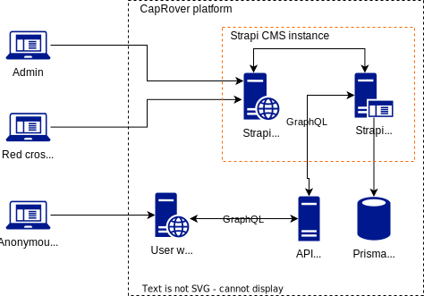

# Red-Cross Ukraine blood donation

Red-Cross blood donation platform for Ukraine

## ABOUT PROJECT

TODO

## ARCHITECTURE

## ASSUMPTIONS

- Repository. We will use the monorepo approach to organize the code base.
- Repository. We will use GitHub as a cloud-based Git repository hosting service. Please check [RC-UA](git@github.com:mrPronin/rc-ua.git) repository for details.
- Back-end. We will use Python as the programming language.
- Back-end. We will use [FastAPI](https://github.com/tiangolo/fastapi) as a web framework.
- Back-end. We will use [Prisma](https://www.prisma.io) as a database abstraction.
- Back-end. We will use GraphQL as an API interface and [Strawberry GraphQL](https://github.com/strawberry-graphql/strawberry).
- DB. We will use PostgreSQL as a database server.
- Content management. We will use [Strapi](https://docs.strapi.io) for content management - an open-source, Node.js based, Headless CMS.
- Front-end. We will use React as a framework to build user web-interface.
- Front-end. We will use TypeScript as the programming language.
- DevOps. We will use [CapRover](https://caprover.com) to deploy and manage platform.

## DOCUMENTATION

- [PROJECT SCOPE AND USER STORIES](docs/001-project-scope-user-stories.md)
- [USER ROLES](docs/002-user-roles.md)
- [TECH STACK](docs/003-techstack.md)
- [LINKS](docs/004-links.md)
- [ENVIRONMENT](docs/005-environment.md)
- [HOW TO RUN](docs/006-how-to-run.md)

## QUESTIONS

TODO

## TODO

- [x] Define platform architecture
- [x] Describe team
- [x] Describe techstack
  - [x] Back-end | API Server
  - [x] Back-end | CMS (backend, admin)
  - [x] Back-end | Persistence
  - [x] Front-end | User web-app
  - [x] DevOps | Platform, hosting, CI&CD
- [x] Define project scope for MVP (version 1.0)
- [x] Define user stories
- [x] Describe environments
- [x] Define 'HOW TO RUN' section
- [ ] Define 'ABOUT PROJECT' section
- [ ] Create user web-app design in Figma
- [ ] Provide rough estimation
  - [ ] Front-end | User web-app
  - [ ] Back-end | CMS (backend, admin)
  - [ ] Back-end | API Server
  - [ ] DevOps | Platform, hosting, CI&CD
