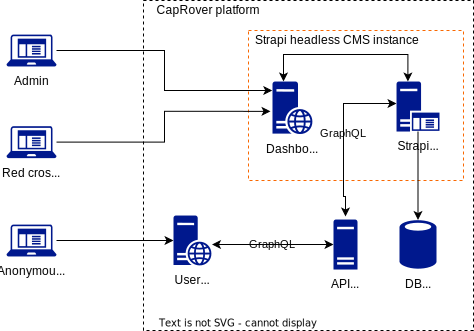

# Red-Cross Ukraine blood donation

Red-Cross blood donation platform for Ukraine

## ARCHITECTURE

- **Admin user, Red cross user, Anonymous user** - please check [user roles](docs/002-user-roles.md) section for detailed description;
- **CapRover platform** - platform to deploy and manage staging environment, please check [environment](docs/005-environment.md) section for detailed description;
- **[Strapi CMS](strapi/README.md)** - headless content management system that includes a back-end instance (Strapi back-end) with a GraphQL interface and a Strapi dashboard web-app as a User Interface for creating the content structure and the content itself.
- **User web-app** - the main user interface of the project for the end user. Using this interface, the end user has access to a list of blood donation centers, news, and background information.
- **[API Server](api-server/README.md)** - the main application server for servicing requests from the User web-app.
- **DB PostgreSQL** - database for storing content - blood donation centers, news and additional reference information.

## ASSUMPTIONS

- Repository. We will use the monorepo approach to organize the code base.
- Repository. We will use GitHub as a cloud-based Git repository hosting service. Please check [RC-UA](git@github.com:mrPronin/rc-ua.git) repository for details.
- Back-end. We will use Python as the programming language.
- Back-end. We will use [FastAPI](https://github.com/tiangolo/fastapi) as a web framework.
- Back-end. We will use [GraphQL](https://graphql.org/) as an API interface and [Strawberry GraphQL](https://github.com/strawberry-graphql/strawberry).
- DB. We will use PostgreSQL as a database server.
- Content management. We will use [Strapi](https://docs.strapi.io) for content management - an open-source, Node.js based, Headless CMS.
- Front-end. We will use React as a framework to build user web-interface.
- Front-end. We will use [TypeScript](https://www.typescriptlang.org) as the programming language.
- DevOps. We will use [CapRover](https://caprover.com) to deploy and manage platform.

## DOCUMENTATION

- [PROJECT SCOPE AND USER STORIES](docs/001-project-scope-user-stories.md)
- [USER ROLES](docs/002-user-roles.md)
- [TECH STACK](docs/003-techstack.md)
- [LINKS](docs/004-links.md)
- [ENVIRONMENT](docs/005-environment.md)
- [API SERVER](api-server/README.md)
- [TODO](docs/007-todo.md)
- [TIME-SHEET RULES](docs/008-time-sheet-rules.md)
